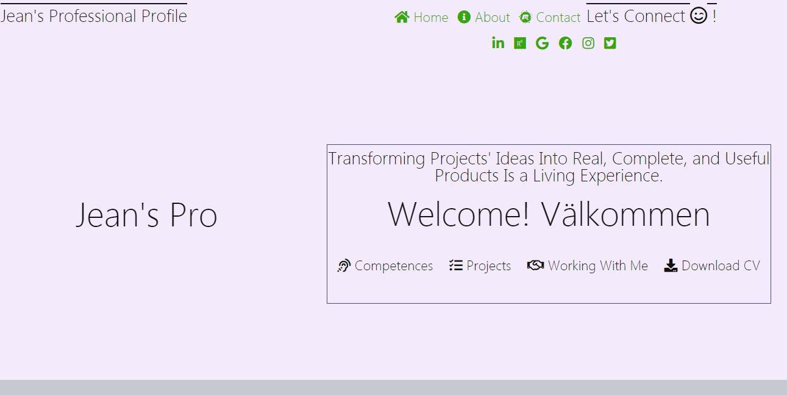

# Welcome to Jean's Online Professional Profile - simplified as <strong>Jean's pro</strong>

## Description

This websites serves for Jean Damascene Twizeyimana's online profile to show case of both his professional and social values. It is also a single source of information on the about Jean's professional journey so far. 

The website was designed and developed with user experience in mind. 
I have followed the five planes of UX as a guiding framework.  Departed from researching data about how to design and develop professional profiles websites and resume in general and in the online space; I have come up with the MUST-HAVE elements of my professional website and the BETTER_TO_HAVE aspects of my professional online profile 
I have design 3 different wireframes and by testing each with its fit to exemplify UX, they yielded into the current end-product here presented.

  The end product here presented is made of the six sections or pages: the index.html, contact us section that is embedded in the index, about us section that is also embedded in the index, competences, projects, working with me, and the read me file. 

  Each Page of the website is divided into three main blocks: header, content seztion, and the footer section.  
  The header element is divided into two main sub-sections: a section for log and main menu; and a section for utility menus.
  the content section contains the content for the section or page concerned. And the footer section for privacy declaration, owner info., and bottom menus.

## User Requirements
As any other web application, to access and use this website you need a functioning computer device equipped with a web browser.   
That is, the user should have access to a computer or tablet or mobile telephone that is equipped with a web brower, for example, Google Chrome, Internet Explorer, and Mozilla Firefox. 

## Technologies
This website is mainly based on HTML (HTML 5 in this case) and CSS (CSS 3 in this case).
IHTML 5 is used to create the structure or web objects, or web pages; and CSS 3 is used for a better layout and look and feel of those objects created with html. 
Additionally, the following frameworks and/or libraries have contributed as follow.
<dl>
   <dt>
      Bootstrap framework
   <dt>
   <dd>
       Bootstrap framework was used in this project to make this website interactive and mobile first. It is also used to speed up the development of the website because bootstrap has a wide range of ready-made css classes for the layout and the presentation.
Now, the <b> Jean's Pro</b>- is, compatible to both small and large devices - departing from mobile phones, tablets to large screens.
 devices facilitate easy layout of web components created using html.  
In this project Bootstrap provided us with css classes to organize the layout using its grid classes and classes for an interactive websites - a website/web application that is compatible to both small and large screens; from mobile phones, tablets to large screens.
   </dd>

<dt>
      Font Awesome
   <dt>
   <dd>
       FontAwesome icons were used to improve the user experience of this website. 
       It provides meaningful and actionable icons which prompt user about the functionality or meaning of the objects on the website.
       Fontawesome icons made this website more user friendly and learnable.
   </dd>

</dl>

## External resources adapted
This website used own captured images and few free licensed images images from https://www.pexels.com/royalty-free-images/  
Also, in the contact us form we have adapted the code from the CI classrum.

## Development Cycle
This website was designed in the cloud by means of Cloud9 via Github and gitpod utilities.
With github the coding journey was documented and can be tracked now.

## Validation and testing
The end product was validated and tested.
The html pages were validated by means of w3c html5 validator.
CSS code was validated by means of w3c jigsaw.
The end product has undergone multiple testing to test the colors against the expect colors to test the layout against the expected layout as of the wireframes.
The product was also tested on mobile devices and medium screens. So far, the product behaves well on mobile and on medium screen devices.
I did not test the product on very large devices.

## The final product look and feel in images
1. Home page Screenshot

2. Contact us section Screenshot

3. Footer Section

4. Working with me section

## Hosting
